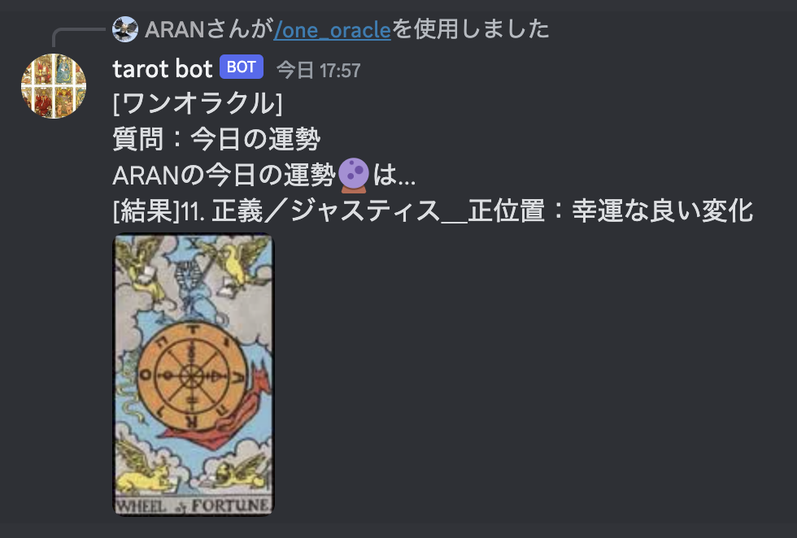

# tarot_bot
## TL;DR
JSで作ったタロット占いができるdiscord botです。

## 機能について
| スラッシュコマンド | 機能 |
| --- | --- |
| `help` | 本botが取り扱うタロット占いについての説明を表示 |
| `one_oracle` | 事前に決めた占い事に対し、一枚のカードから占います。[学業、金運、恋愛etc…] |
| `two_oracle` | 事前に決めた質問に対する結果と対策について、2枚のカードから占います。 |
| `three_card` | 過去・現在・未来の流れを３枚のカードから占います。 |

## discord botチュートリアルとしての運用について
1. このリポジトリをcloneする。
2. 一番外のディレクトリに「.env.example」ファイルを参考に「.env」ファイルを作成する。
3. ターミナルで「npm install」を実行する
4. ターミナルで「node deploy-commands.js」を実行し、botにスラッシュコマンドを登録する。
5. ターミナルで「node index.js」を実行し、botを起動する。

## 参考資料
- [タロット占いについて](https://atelier365.net/blog/tarot-spread/)
- [discord botを用意する方法について](https://qiita.com/1ntegrale9/items/cb285053f2fa5d0cccdf)
- [JavaScriptでdiscordを作る方法について](https://discordjs.guide/#before-you-begin)

